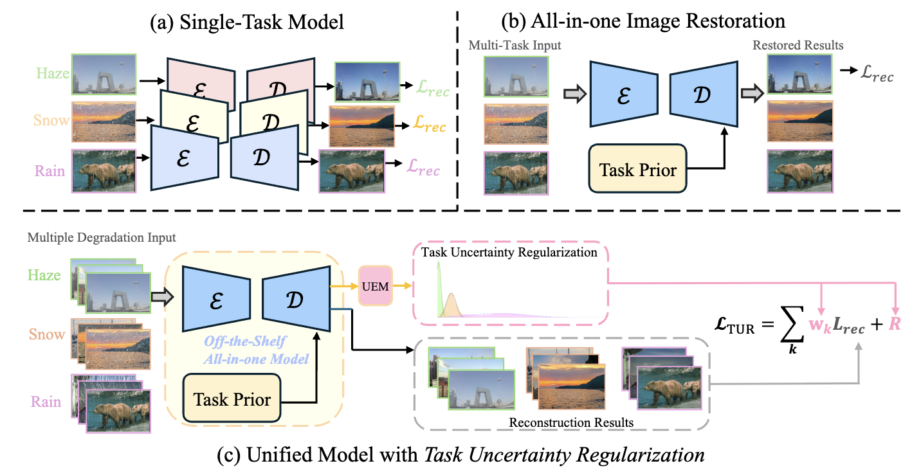
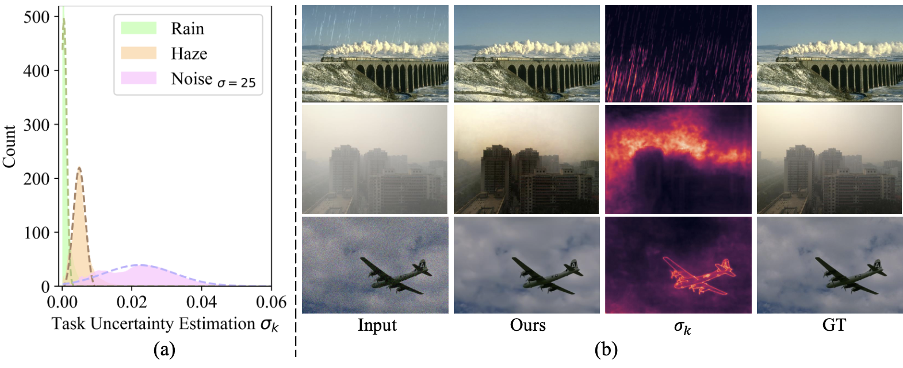
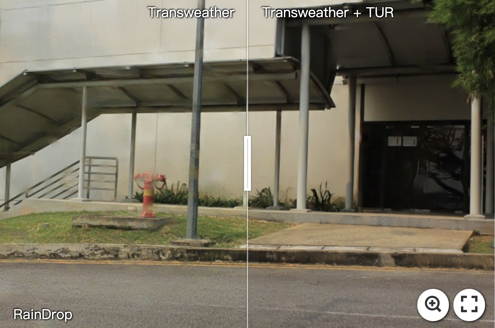
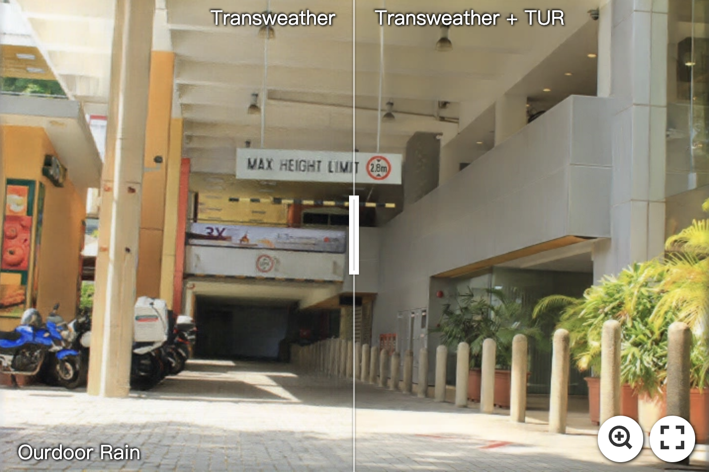
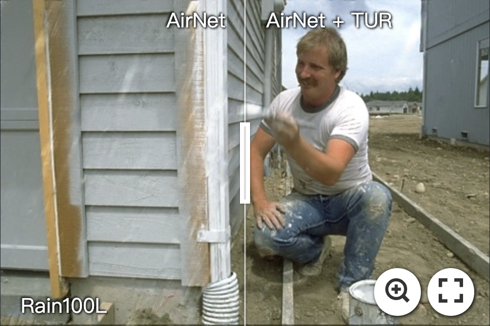
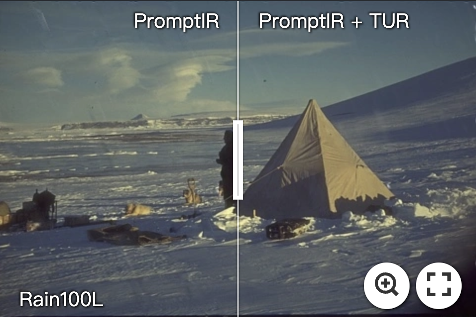

<div align="center">
<a href="https://www.imagehub.cc/image/TUR-logo.CJAeR0"></a>

# [AAAI 2025] Debiased All-in-one Image Restoration with Task Uncertainty Regularization

[Gang Wu (吴刚)](https://scholar.google.com/citations?user=JSqb7QIAAAAJ), [Junjun Jiang (江俊君)](http://homepage.hit.edu.cn/jiangjunjun), [Yijun Wang (王奕钧)](), [Kui Jiang (江奎)](https://github.com/kuijiang94), and [Xianming Liu (刘贤明)](http://homepage.hit.edu.cn/xmliu)

[AIIA Lab](https://aiialabhit.github.io/team/), Faculty of Computing, Harbin Institute of Technology, Harbin 150001, China.

[](https://openreview.net/forum?id=kx7eyKgEGz&referrer=%5BAuthor%20Console%5D(%2Fgroup%3Fid%3DAAAI.org%2F2025%2FConference%2FAuthors%23your-submissions))
[]()
[](https://huggingface.co/GWu/TUR)
[](https://pan.baidu.com/s/1YN3P-CmnisXVIdLHTWB9Fw?pwd=AAAI)
<a href="https://hits.seeyoufarm.com"></a>
</div>

</div>


## Overview

<div align="center"> <table> <tr> <td align="center"><br>Framework</td> <td align="center"><br>Task Uncertainty</td> </tr> </table> </div>


>All-in-one image restoration is a fundamental low-level vision task with significant real-world applications. The primary challenge lies in  addressing diverse degradations within a single model. While current methods primarily exploit task prior information to guide the restoration models, they typically employ uniform multi-task learning, overlooking the heterogeneity in model optimization across different degradation tasks. To eliminate the bias, we propose a task-aware optimization strategy, that introduces adaptive task-specific regularization for multi-task image restoration learning. Specifically, our method dynamically weights and balances losses for different restoration tasks during training, encouraging the implementation of the most reasonable optimization route. In this way, we can achieve more robust and effective model training. Notably, our approach can serve as a plug-and-play strategy to enhance existing models without requiring modifications during inference. Extensive experiments across diverse all-in-one restoration settings demonstrate the superiority and generalization of our approach. For instance, AirNet retrained with TUR achieves average improvements of **1.3 dB** on three distinct tasks and **1.81 dB** on five distinct all-in-one tasks. These results underscore TUR's effectiveness in advancing the SOTAs in all-in-one image restoration, paving the way for more robust and versatile image restoration.


## Results

<div align="center"> <table> <tr> <td align="center"><a href="https://imgsli.com/MzI3MzEz"></a></td> <td align="center"><a href="https://imgsli.com/MzI3MzE0"></a></td> </tr> <tr> <td align="center"><a href="https://imgsli.com/MzI3MzEw"></a></td> <td align="center"><a href="https://imgsli.com/MzI3MzE2"></a></td> </tr> </table> 

</div>

### 7 Degradation Tasks

Detail experiment settings and datasets can be found at [MioIR](https://github.com/Xiangtaokong/MiOIR/tree/main).

Our retrained Mixed [Uformer-TUR](https://huggingface.co/GWu/TUR/blob/main/Uformer_TUR_7task.pth).


### 3 Degradation Tasks
Detail experiment settings and datasets can be found at [AirNet](https://github.com/XLearning-SCU/2022-CVPR-AirNet) and [PromptIR](https://github.com/va1shn9v/PromptIR) project pages.

Our retrained [AirNet-TUR](https://huggingface.co/GWu/TUR/blob/main/AirNet_TUR_3task.pth) .


### 5 Degradation Tasks

Our retrained [Transweather-TUR](https://huggingface.co/GWu/TUR/blob/main/Transweather_TUR_5task.pth).

### Deweather Tasks
Detail experiment settings and datasets can be found at [Transweather](https://github.com/jeya-maria-jose/TransWeather) and [WGWS-Net](https://github.com/zhuyr97/WGWS-Net).

Our retrained Transweather-TUR for [AllWeather](https://huggingface.co/GWu/TUR/blob/main/Transweather_TUR_AllWeather.pth) and [Real-World deweathering](https://huggingface.co/GWu/TUR/blob/main/Transweather_TUR_real.pth).


## Citation
If our project helps your research or work, please cite our paper or star this repo. Thank you!
```
@inproceedings{wu2025debiased,
  title={Debiased All-in-one Image Restoration with Task Uncertainty Regularization},
  author={Gang Wu, Junjun Jiang, Yijun Wang, Kui Jiang, and Xianming Liu},
  booktitle={Proceedings of the AAAI Conference on Artificial Intelligence},
  year={2025}
}
```

## Acknowledgement

This project is based on [AirNet](https://github.com/XLearning-SCU/2022-CVPR-AirNet), [PromptIR](https://github.com/va1shn9v/PromptIR), [MioIR](https://github.com/Xiangtaokong/MiOIR/tree/main/basicsr), [Transweather](https://github.com/jeya-maria-jose/TransWeather), and [WGWS-Net](https://github.com/zhuyr97/WGWS-Net), thanks for their nice sharing.
